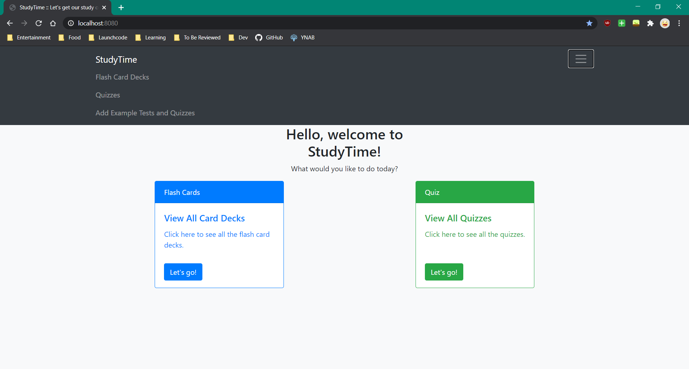
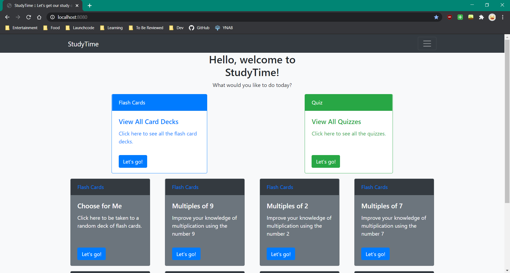
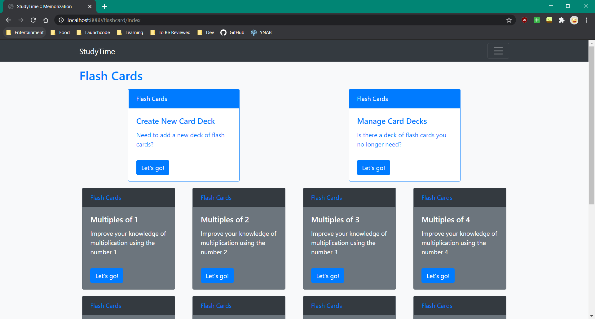
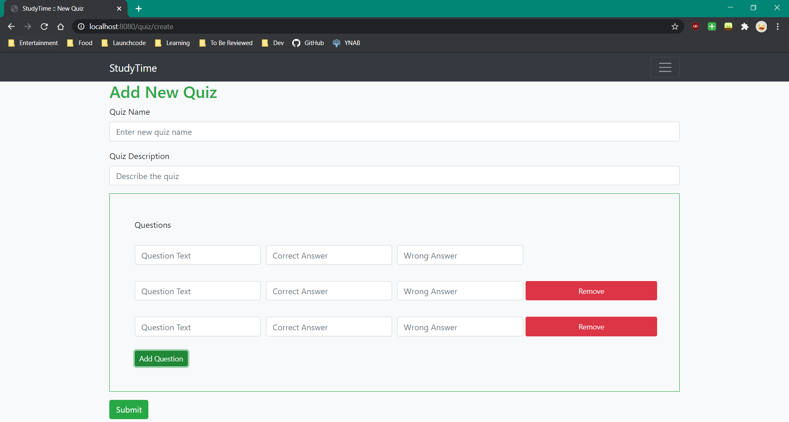
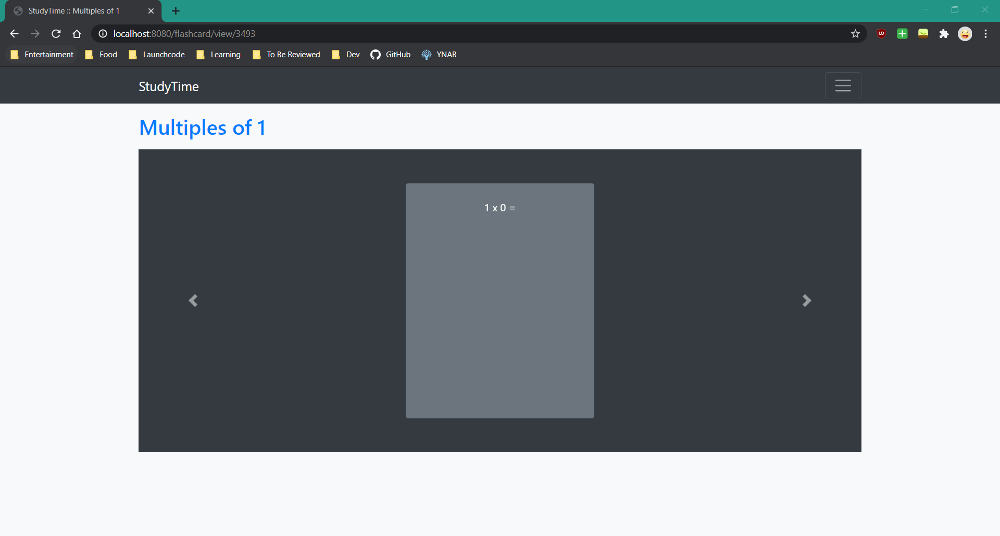
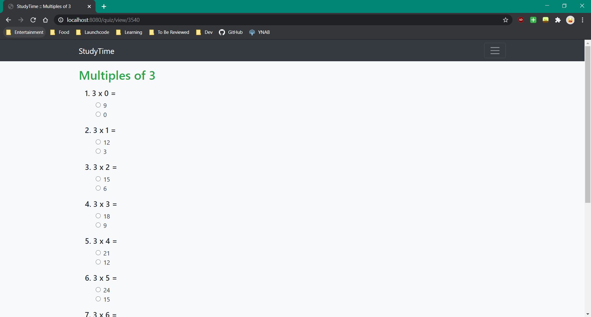

# StudyTime

An app that enables studying through flash cards and quizzes. It was built primarily with Java using Spring. It includes 
Spring Security for user login and Spring Data JPA to connect to a MySQL database. Uses Thymeleaf for views, and  
Bootstrap for style and responsiveness. Shared under the MIT licese.

## Table of Contents
- [StudyTime](#studytime)
  * [Table of Contents](#table-of-contents)
  * [How to Run This Repo](#how-to-run-this-repo)
    + [Requirements](#requirements)
    + [Instructions](#instructions)
  * [Overview of the App](#overview-of-the-app)
  * [Features](#features)
    + [Future Features](#future-features)
    + [Completed Features](#completed-features)

## How to Run This Repo
### Requirements
1. Java JDK 14
2. MySQL database set up on your local machine
3. IntelliJ or similar IDE


### Instructions
1. Clone or download repo to your local machine.
2. Set up a MySQL schema with the name of your choice. Set up a user with access to the schema.
3. Open the project in your IDE of choice and navigate to Study-App\src\main\resources\application.properties
4. Update the top of the file with your chosen username, password, and schema name & location :
        
        spring.datasource.url=jdbc:mysql://localhost:3306/study-app
        spring.datasource.username=user
        spring.datasource.password=greatpassword

5. Run gradle and verify the following tables are present in your schema:
    * card_deck
    * flash_card
    * question
    * quiz
    
6. Check the log to for the port the project is running on with Tomcat. The Tomcat message will look like this:
   
    ```2020-07-31 17:05:23.658  INFO 11332 --- [  restartedMain] o.s.b.w.embedded.tomcat.TomcatWebServer  : Tomcat started on port(s): 8080 (http) with context path ''```

7. Navigate to the mentioned port in the browser. Mission successful! :rocket:


## Overview of the App

The home page of the app on start-up will have a navigation bar at the top and 2 cards. Clicking the StudyTime brand in 
 the nav bar will lead back to the home page of the app. Clicking the hamburger menu in the upper right opens the nav bar.
 In the nav bar there are links to the index pages for flash cards and quizzes. There is also a link that will generate
 some flash cards and quizzes covering basic multiplication to the app. This is to allow full functionality to be seen 
 quickly after set up.
 


After flash cards or quizzes are added either with the dummy data shortcut or manually, links will show on the home page
 leading to randomly selected flash card decks and quizzes.



The flash card and quiz index pages are set up the same. The top cards allow you to create and delete, and all quizzes and
 flashcard decks will display below.
 


Below is the quiz creation screen. The form is dynamic and allows the user to add or subtract fields as needed. Flash card
 deck creation is dynamic as well.



Below is a screenshot of the flash cards in use and a quiz. The flash cards flip on click and are on a carousel to 
navigate through them.





## Features

* Bootstrap carousel with custom flipping flash cards.

* Server side validation of all user forms.

* Ability for user to add quizzes and flash card decks with dynamic forms.

* Ability for user to delete quizzes and flash card decks.

* Ability to automatically add dummy data for testing/demo.

* Home page with randomly displayed flash card decks and quizzes.

* Categories and ability to view flash card decks and quizzes together by category.

* Search page for seeing quizzes, flash cards, and categories containing user-specified text.
